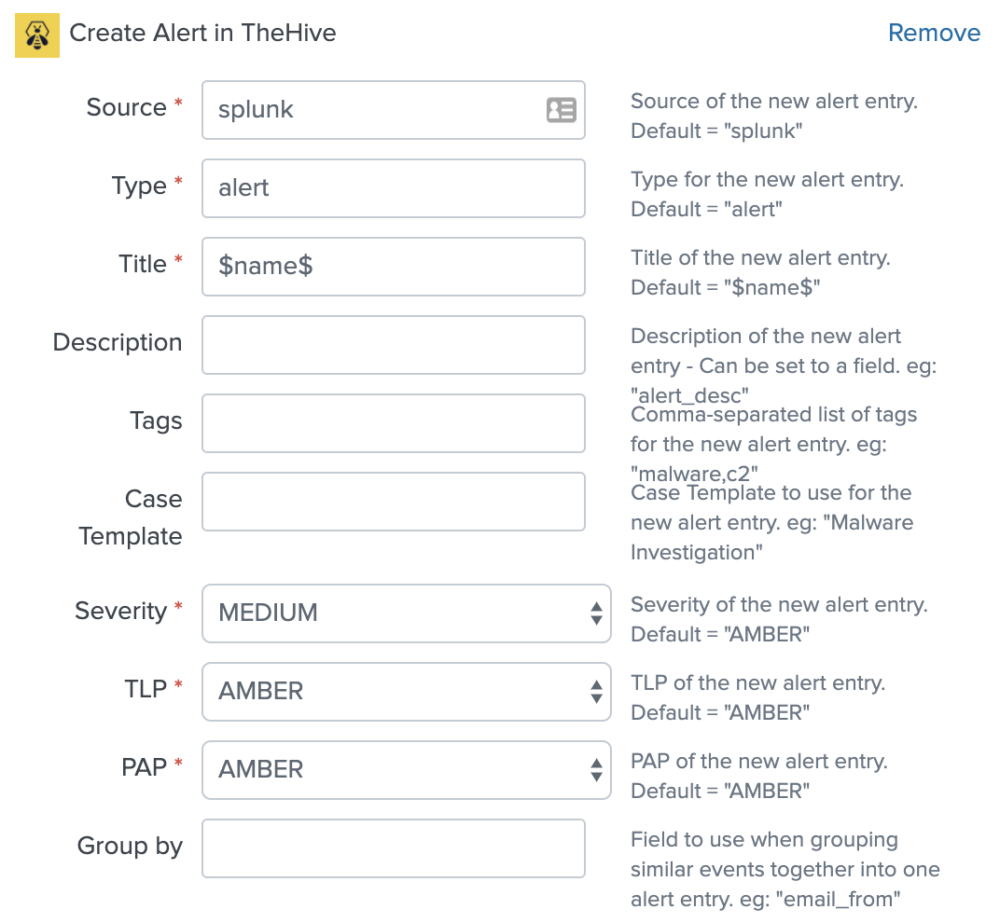

# TA-TheHive-Addon

This add-on is designed to add the ability to create an alert entry in [TheHive](https://thehive-project.org/) as an action to a Splunk alert. Includes general QoL improvements such as formatting alert descriptions, grouping alerts, etc.

# Installation

1. Download the latest [TA-TheHive-Addon](https://github.com/cwru-iso/TA-TheHive-Addon/releases/latest) app package.
2. Install the app on your Splunk search head(s):  
Apps Dropdown -> Manage Apps -> Install app from file
3. Restart Splunk (for later updates, you may skip this step)
4. At next logon, launch the app:  
Apps Dropdown -> TheHive Add-on
5. Configure the Add-on to use your instance URL and keys.

Alerts can now use the "Create alert in TheHive" action.

# Usage

**Title** - `$name$` will automatically be replaced with the Title of the Alert itself by Splunk. 

**Description** - Can be either static text OR a field name (eg: "alert_desc"). All `\n`'s will be replaced with actuall newlines.

**Case Template** - The name of the template itself in TheHive, including spaces.

**PAP** - Not supported by TheHive at this time, but there as a placeholder.

**Group by** - _Must_ be a field that exists in the table output. All alerts that have the same value for that field will have their artifacts grouped into a single alert.

The Title, SourceRef, and Description, will only be pulled from the _first_ occurrence.

# Licence

This Splunk app is licensed under the GNU General Public License v3.0.

# Credits

Heavily inspired by [remg427/TA-thehive](https://github.com/remg427/TA-thehive).

# Authors

Kyle Colantonio <`kyle.colantonio@case.edu`>  
Case Western Reserve University